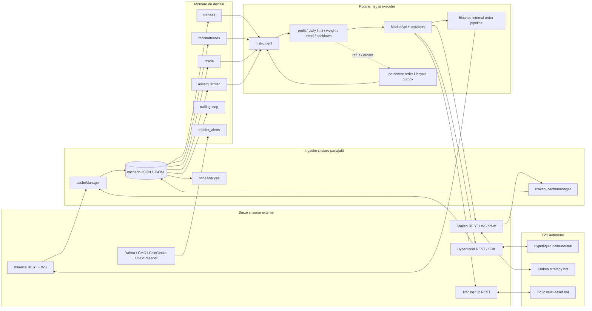
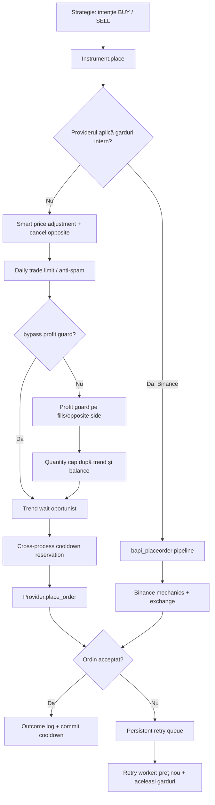
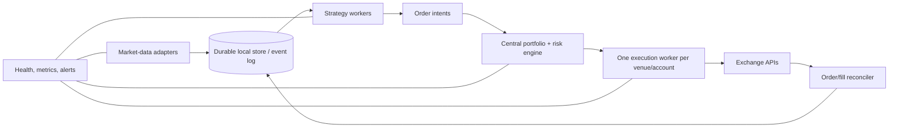

# System design — platforma de trading existentă

Data analizei: 19 august 2026  
Sursă: codul din `/home/mariusp/binance` (analiză read-only)

## 1. Rezumat executiv

Sistemul este o platformă personală de trading multi-venue, construită ca un ansamblu de procese Python independente. Nu există un server central sau o bază de date relațională. Procesele cooperează în principal prin fișiere JSON/JSONL din `cachedb/`, iar accesul la burse este abstractizat parțial prin `providers/market_api.py` și `Instrument`.

Arhitectura are două familii:

1. **Flota integrată** — procese Binance/multi-provider care împart cache-uri și pipeline-ul comun de ordine: `cacheManager`, `priceAnalysis`, `tradeall`, `monitortrades`, `rtrade`, `assetguardian`, `market_alerts`, `order_retry_worker`.
2. **Boți autonomi per venue** — Hyperliquid, Kraken și Trading212. Au propriile loop-uri, clienți API, configurații și state machines. Unele date Kraken și ordinele inițiate prin `Instrument` sunt integrate cu nucleul comun.

Caracteristicile dominante sunt:

- procese long-running, threads interne și polling;
- WebSocket Binance pentru prețuri și evenimente de cont, cu fallback REST;
- stare persistentă în fișiere, scrieri atomice și uneori lock-uri `fcntl`;
- mai multe strategii care pot produce intenții de ordin;
- pipeline comun de risc pentru `Instrument`, dar Binance păstrează propriul pipeline intern;
- supervizare pe două niveluri: systemd + `fleet_supervisor.sh` pentru flotă, cron + `healthcheck.sh` pentru boți;
- configurație distribuită între `*.env`, `*.conf`, `instruments.conf` și constante Python.

## 2. Context și limite

### Venue-uri

| Venue | Rol curent | Execuție |
|---|---|---|
| Binance Spot | nucleul istoric al flotei; BTCUSDC și TAOUSDC | live prin `bapi_placeorder` |
| Kraken Spot | HYPEUSD, cache comun de fills, bot propriu, trailing | live doar sub porți/config |
| Hyperliquid | bot delta-neutral SPOT + PERP; provider HYPE spot | providerul comun este dry-run implicit; DN este separat |
| Trading212 | acțiuni SPCX/NVDA/RGNT, thread per activ | bot autonom, paper/live configurabil |
| Yahoo/CMC/CoinGecko/DexScreener | market data și discovery | fără execuție |

### Delimitare live vs research

Directoarele `offline/research/`, `sim/`, `archive/old_trade/`, `tests/`, `forecast/` și scripturile de backtest nu fac parte din runtime-ul declarat în `procs.conf`. `forecast/` poate fi folosit ca analiză experimentală, dar nu tranzacționează în fluxul live principal.

## 3. Design high-level



### Fluxul principal end-to-end

1. `cacheManager.py` colectează prețuri, ordine, trades, valoarea contului și trendul scurt. Pentru Binance folosește WS plus polling; pentru instrumente non-Binance rulează un poller cu deadline dur.
2. Datele sunt persistate în `cachedb/`. Fișierele istorice append-only folosesc JSONL; snapshot-urile folosesc JSON și `os.replace` atomic.
3. `priceAnalysis.py` consumă istoricul și produce trendul lung în `priceanalysis.json`/cache-ul `PriceLongTrend`.
4. Procesele de strategie citesc prețuri, trenduri, balances, ordine sau fills și decid BUY/SELL.
5. Pentru calea generică, strategia operează prin `Instrument`, care leagă explicit simbolul de un provider.
6. `Instrument.place()` aplică gardurile comune pentru provideri non-Binance. Pentru Binance deleagă către pipeline-ul intern, care are mecanisme echivalente și logică suplimentară.
7. Intenția este persistată înainte de submit. Worker-ul reconciliază răspunsurile ambigue prin client ID, reevaluează retry-ul la prețul curent și prin garduri, apoi păstrează ordinul acceptat până la status terminal. `open`/partial nu se retrimit; `REJECTED`/`EXPIRED` pot relua numai restul neexecutat, iar `CANCELED` este terminal și alertat.
8. Evenimentele și anomaliile sunt logate și pot genera notificări ntfy/email/desktop.

`order_retry.py` este și modulul canonic pentru `TrackedOrderLifecycle`. Acesta nu este
un daemon separat: strategiile cu state financiar propriu îl apelează la fiecare tick,
iar `order_retry_worker.py` rămâne consumatorul unic doar pentru outbox-ul global.
Detaliile și limitele migrării sunt în `docs/ORDER_LIFECYCLE_CENTRALIZATION.md`.

## 4. Runtime și deployment

### Inventarul unic

`procs.conf` este registrul proceselor. Formatul descrie pattern-ul de proces, working directory, comanda de start, label-ul, heartbeat-ul și rolul `fleet` sau `bot`.

### Flota

`systemd/binance.service` pornește `fleet_supervisor.sh` după `pia.service`. Scriptul:

- impune single-instance prin `flock`;
- așteaptă VPN-ul PIA;
- activează `.venv` sau `myenv`;
- pornește toate intrările `role=fleet`;
- verifică startup-ul;
- supraveghează PID-urile la 30 secunde și repornește procesele moarte;
- instalează watchdog-urile de cache/config și anomalii în cron.

### Boții autonomi

`restart_bots.sh` pornește intrările `role=bot` în ordinea manifestului. `healthcheck.sh --supervise`, rulat periodic, detectează atât procese absente, cât și procese vii cu heartbeat stale. Aplică maximum trei restarturi într-o fereastră de 30 minute, apoi escaladează ca crash-loop.

### Protecție operațională

- `fleet_supervisor.sh` are lock dedicat și închide descriptorul înainte de spawn.
- `healthcheck --supervise` refuză explicit pornirea din checkout-ul local `/home/mariusp`.
- systemd repornește supervizorul flotei, nu fiecare proces Python separat.
- VPN PIA este o dependență hard pentru flota de producție.

## 5. Componentele flotei

### 5.1 `cacheManager.py` — data plane local

Este componenta centrală a flotei. `CacheFactory` creează singletons per tip de cache:

| Manager | Date | Persistență / rol |
|---|---|---|
| `CacheTradeManager` | fills/trades | istoric, append |
| `CacheOrderManager` | ordine executate | garduri și reconcilieri |
| `CacheSparsePriceManager` | istoric rar/lung | JSONL per simbol |
| `Cache24PriceManager` | fereastră 24h | snapshot bounded per simbol |
| `CacheCurrentPriceManager` | ultimul preț | snapshot comun |
| `CachePriceLongTrendManager` | trend lung | rezultat `priceAnalysis` |
| `CacheAssetValueManager` | valoarea portofoliului | serie temporală |
| `CachePriceShortTrendManager` | trend instant | semnale și trend-wait |

Mecanisme importante:

- WebSocket account stream transformă `executionReport` direct în order/trade cache, fără round-trip REST.
- Dacă WS devine nesănătos, polling-ul poate prelua rolul de reconciliere.
- Current-price și history au subscriber pattern pentru propagare internă.
- Fetch-urile non-Binance au deadline de 15 secunde pentru a evita blocarea permanentă în DNS/socket.
- `CacheFactory` este singleton pe nume; prima listă de simboluri fixează instanța, iar cererile ulterioare cu alte simboluri sunt ignorate cu warning.
- Scrierea este atomică, dar concurența cross-process rămâne în general `last-writer-wins` acolo unde nu există lock comun.

### 5.2 `pricefetcher.py` — agregare multi-source

Definește `PricePlatformInterface` și implementări pentru Binance, Hyperliquid, CoinMarketCap și Yahoo. `CacheAllPriceFetcherManager` menține prețuri pentru alerte/discovery, cu retenție de șapte zile, maximum 2.000 puncte per simbol și maximum 20 simboluri urmărite.

Acesta servește în special `market_alerts`, nu este sursa unică a ordinelor live.

### 5.3 `priceAnalysis.py` — trend lung

Consumă istoricul de preț și calculează trenduri prin ferestre temporale reale:

- fereastră și pas în ore, nu număr fix de samples;
- minimum de puncte și oprire la gaps;
- blocuri consecutive cu toleranță la zgomot;
- Mann-Kendall pentru semnificație statistică;
- Hurst ca informație despre regim;
- lag intenționat de detecție, implicit 48h;
- estimare empirică a duratei trendului și curbă Lindy/plateau pentru pondere.

Rezultatul lung alimentează limitarea cantității și filtrele strategiilor.

### 5.4 `tradeall.py` — trend/momentum pe ferestre scurte

Este motorul reactiv principal. Menține ferestre de preț mici și mari, `TrendState` per simbol și un `TrendCoordinator`. Detectează schimbări de pantă/gradient și cere ordine când semnalul este confirmat suficient.

Protecții locale observate:

- număr minim de confirmări și durată minimă a trendului;
- praguri separate pentru mișcări normale și mari;
- limită de retry/fire per trend;
- filtru Kalman opțional pentru simboluri selectate;
- interval dinamic de evaluare, între 1,5 și 30 secunde;
- jurnal de decizii și outcomes pentru backtest/audit.

Execuția trece prin `Instrument`/facadă, dar configurația curentă a procesului rămâne în `tradeall_config.env`, nu în registrul central `instruments.conf`.

### 5.5 `monitortrades.py` — managementul ciclului poziției

Este consumatorul real al `instruments.conf`. Pentru fiecare instrument activ:

- citește istoricul ordinelor/fills;
- reconstruiește poziția relevantă și referința last/average;
- verifică profit/loss thresholds și vechimea;
- implementează hard take-profit fracționat cu cooldown;
- poate cumpăra din nou, cu buget per buy și plafon total;
- plasează prin `Instrument`, cu safeback configurabil și qty minim de venue.

Instrumente active în configurația curentă: Binance BTCUSDC, Binance TAOUSDC și Kraken HYPEUSD. Hyperliquid HYPE și acțiunile T212 sunt declarate, dar dezactivate pentru acest consumator.

### 5.6 `rtrade.py` — market making/repricing

`TradingBot` gestionează cicluri BUY/SELL cu spread inițial și ajustarea progresivă a prețului. Are:

- perioade normale și perioade „desperate”;
- decay separat pe BUY/SELL;
- safeback pentru ordine forțate;
- follow-up după execuții;
- filtru care blochează tranzacționarea când trendul este prea puternic;
- plafon pentru eșecuri consecutive.

Folosește calea de ordin safe (`smart=False`) acolo unde nu dorește anularea ordinelor opuse sau nudge automat.

### 5.7 `assetguardian.py` — protecția valorii portofoliului

Compară valoarea totală curentă cu o referință istorică din cache. Poate:

- lichida activele când portofoliul scade peste prag;
- cumpăra activul țintă cu aproape tot cash-ul după o creștere definită;
- ignora quote/stable assets și rezolva simbolul de vânzare pentru fiecare activ.

Este un control la nivel de portofoliu, separat de strategiile per simbol. Impliciturile din cod indică o verificare aproximativ la 54 secunde, referință la 24h și prag de scădere de 7%.

### 5.8 `market_alerts.py` — alerte și discovery

Orchestrează:

- price alerts configurabile;
- descoperirea monedelor noi din CMC, CoinGecko, Binance și DexScreener;
- cleanup periodic;
- notificări prin `AlertNotifier`.

Nu plasează ordine în fluxul analizat.

### 5.9 `order_retry.py` + `order_retry_worker.py`

Coada persistentă este `cachedb/order_retry_queue.jsonl`, protejată cu file lock. Înregistrările conțin intenția originală, prețurile de referință, timestamps și numărul de încercări.

Worker-ul:

- elimină intrările expirate și notifică renunțarea;
- verifică intervalul minim și price tolerance;
- revendică înregistrările înainte de procesare;
- obține prețul curent;
- reapelează `Instrument.place(..., caller_owns_retry=True)`;
- trece din nou prin toate gardurile și nu creează retry recursiv.

Kill-switch-ul ține worker-ul viu, dar idle, pentru a evita flapping-ul supervizorului.

## 6. Abstracția multi-provider

### `MarketDataProvider` și `StrategyExecutor`

`providers/base.py` conține mecanica fără registry, astfel încât adaptoarele pot fi
importate independent, fără ciclul provider → `market_api` → provider.

Contractul `MarketDataProvider` include:

- market data: `get_current_price`, `get_price_history`, `supports_symbol`;
- cont: `free_balance`, `get_orders`, `get_trades`, `open_orders`;
- execuție: `place_order`, plus hooks pentru mecanica și gardurile venue-ului;
- normalizarea ordinelor la `{side, price, qty, timestamp_ms}`.

Contractul strict `StrategyExecutor` acoperă execuția urmărită financiar:
`submit_order`, `order_status`, `cancel_order`, `pair_precision`, `free_balance` și
`ohlc_closes`. Kraken, Hyperliquid, Binance și Trading212 trec aceeași gardă de
conformitate. Contractul comun nu obligă venue-urile să folosească aceeași strategie
sau aceiași parametri.

Motorul spot DCA/trailing este canonic în `strategies/spot_dca.py`. Launcherul Kraken
injectează `KrakenProvider`; replay-ul injectează executorul său. Vechiul
`kraken/strategy.py` este doar shim de compatibilitate, iar T212 și HL își păstrează
motoarele financiare distincte.

`MarketApi` deține registry-ul providerilor și poate ruta implicit după symbol. `Instrument` preferă rutarea explicită după numele providerului, evitând ambiguitatea când același activ există pe mai multe venue-uri.

### `Instrument`

Este obiectul de domeniu care leagă:

```text
name + native symbol + provider + base/quote + market hours + isolation + params namespaced
```

Oferă API generic pentru preț, istoric, sold, ordine, trades și plasare. Parametrii sunt namespaced (`mt.*`, viitor `tradeall.*`, `rtrade.*`). În prezent doar `monitortrades` consumă efectiv registrul central.

### Providerii

- **BinanceProvider** deleagă către modulele istorice `bapi`, `bapi_allorders`, `bapi_placeorder`. Declară că își aplică gardurile intern.
- **KrakenProvider** folosește clientul Kraken și cache-ul separat de fills; ordinele live sunt gated.
- **HyperliquidProvider** deservește HYPE spot, separă fills spot de fills perp și încarcă SDK-ul lazy. Ordinele sunt dry-run implicit.
- **T212Provider** implementează execuția strictă, status/partial fills, anularea și
  precizia pe API-ul public T212. Citirile de portofoliu sunt fail-closed. Instrumentele
  T212 din `instruments.conf` rămân dezactivate ca să nu concureze cu botul autonom.

## 7. Pipeline-ul ordinului și gardurile de risc



Gardurile comune sunt fail-closed: dacă verificarea produce excepție, ordinul este refuzat. `bypass_profit_guard` sare doar profit guard și quantity weight; nu sare daily limit, trend-wait sau cooldown.

Pipeline-ul Binance include suplimentar:

- normalizarea quantity/price la limitele exchange;
- verificarea trade-enabled;
- weight bazat pe trend lung;
- profit guard pe fereastra istorică;
- maximum daily trades;
- așteptare pentru trend favorabil;
- cooldown și client order IDs;
- mecanica de LIMIT/MARKET, anulare și repricing.

## 8. Boții autonomi

### 8.1 Hyperliquid delta-neutral

`dn_bot.py` construiește `HLClient`, `DNParams` și `DeltaNeutral`. State machine-ul persistă separat per coin și coordonează:

- long spot;
- short perp;
- delta și rebalance;
- funding, collateral și risc de lichidare;
- mod status și watcher read-only;
- notificări și single-instance.

Este separat logic de providerul Hyperliquid folosit de flotă. Riscul major explicit în design este că ambele văd același sold spot HYPE. De aceea execuția HYPE prin `monitortrades` este dezactivată până la izolare prin wallet/subaccount sau contabilitate robustă.

### 8.2 Kraken

Subsistemul are mai multe procese:

- `kraken_cachemanager.py`: un singur reader al istoricului de fills, polling implicit la 30s sau WS privat opțional; scrie `cache_trade_kraken.json` atomic;
- `kraken_bot.py` + `strategy.py`: strategie autonomă, stare per pair și polling la aproximativ un minut;
- `kraken_xstock_watch.py`: watcher/alerte, fără execuție xStocks;
- `kraken/trailing_stop.py`: adaptor peste `TrailingCore`;
- `KrakenProvider`: integrarea HYPEUSD în `monitortrades`.

Cheile API trebuie separate per proces deoarece nonce-ul Kraken este strict crescător per cheie. Soldul contului este comun tuturor proceselor, deci rămâne risc de over-allocation dacă două strategii acționează simultan.

### 8.3 Trading212

`t212_bot.py` descoperă `config.*.env` și pornește câte un thread per activ, folosind un client comun thread-safe. Pentru fiecare activ:

- verifică ISIN-ul;
- poate aștepta listing/market launch;
- creează `Strategy` cu stare JSON separată;
- aplică entry, DCA, take-profit ladder, stop-loss catastrofic, buget maxim și FX;
- poate rula paper sau live.

Este un motor autonom și nu folosește în mod normal pipeline-ul `Instrument`.

### 8.4 Trailing stop partajat

`trailing_core.py` conține state machine-ul provider-agnostic:

1. warmup până la profitul minim;
2. urmărirea peak-ului;
3. sell când drawdown-ul depășește trail-ul;
4. urmărirea minimului după sell;
5. rebuy la bounce, cu filtru de trend.

Adaptoarele Binance și Kraken implementează numai asset discovery, balance, price, trend, execuție, persistență și logging/notificări. Starea peak/rebuy supraviețuiește restartului.

## 9. Persistență și model de consistență

### Categorii de date

| Categorie | Exemple | Model |
|---|---|---|
| Market history | `cache_price_*.jsonl`, `cache_asset_value.jsonl` | append + retenție/rotație |
| Snapshot | `cache_currentprice.json`, `cache_24price_*.json` | full rewrite atomic |
| Exchange activity | `cache_trade.json`, `cache_order.json`, `cache_trade_kraken.json` | cache reconciliat |
| Strategy state | `.state_*.json`, trailing state | state machine persistent |
| Coordination | cooldown, retry queue, lock files | lock + fișiere locale |
| Observability | `logs/`, `logger/`, outcomes | text/structured-ish logs |

### Semantica reală

- Sistemul este **eventually consistent**, nu tranzacțional end-to-end.
- Scrierea atomică previne fișiere JSON parțiale, dar nu rezolvă automat conflictele dintre doi writers.
- `strategies/state_store.py` este primitiva comună pentru starea financiară Kraken și
  T212: schema veche este completată la citire, scrierea folosește `fsync + os.replace`,
  iar runtime-ul real refuză starea coruptă sau discul indisponibil. Resetarea la stare
  goală este permisă numai în PAPER.
- Unele resurse critice folosesc lock (`retry`, cooldown, process singleton); cache-urile generale se bazează mai mult pe un writer principal și `last-writer-wins`.
- Restartul recuperează state-ul de strategie și cache-urile, apoi API polling/WS reconciliază cu exchange-ul.
- Exchange-ul rămâne sursa finală de adevăr pentru balance, fills și open orders.

## 10. Observabilitate și notificări

- fiecare proces scrie în log separat;
- `fleet_supervisor` verifică PID, nu heartbeat, la fiecare 30s;
- `healthcheck` verifică PID + freshness pentru boții configurați;
- watchdog-ul de cache/config poate omorî procesul proprietar al unui cache stale, iar supervizorul îl reînvie;
- watchdog-ul de anomalii urmărește rata erorilor din loguri;
- `AlertNotifier` rutează spre ntfy, email și opțional desktop/audio;
- `order_outcomes_log` creează audit fleet-wide al ordinelor executate/refuzate;
- există un health report consolidat pentru conturile HL, Kraken și T212.

## 11. Puncte forte

1. Izolare bună a defectelor prin procese separate.
2. Supervizare stratificată și protecție anti-crash-loop.
3. Fallback WS → REST și deadline explicit pentru fetch-uri non-Binance.
4. Stare persistentă pentru strategii și trailing, deci restarturile nu uită poziția logică.
5. Scrieri atomice și lock-uri pentru coordonările cele mai sensibile.
6. Pipeline de risc explicit și fail-closed.
7. Facadă multi-provider și `Instrument` care permit migrarea graduală din codul Binance-specific.
8. Backtesting/research și multe teste unitare pentru mecanici, garduri și regresii.
9. Manifest unic pentru procese, eliminând drift-ul între start și healthcheck.

## 12. Riscuri și datorie arhitecturală

### Critice

1. **Mai multe strategii împart același cont și aceeași balanță.** Nu există un ledger central de rezervări pe strategie. Cooldown-ul reduce simultaneitatea, dar nu rezervă capitalul pe termen lung.
2. **Hyperliquid spot este co-mingled cu piciorul spot al DN.** Un sell al flotei poate rupe hedge-ul. Configurația curentă evită asta prin dezactivare, nu prin izolare structurală.
3. **Retry pentru orice refuz poate păstra intenții care nu mai sunt economic valide.** Price gate și TTL ajută, dar o decizie strategică veche poate reveni după schimbarea regimului.
4. **Fișierele locale sunt infrastructura de mesagerie și baza de date.** Corupția, writers multipli, NFS/backup inconsistent sau filesystem full pot afecta mai multe procese.

### Ridicate

5. Există două pipeline-uri de risc: unul generic și unul Binance-specific. Ele urmăresc aceeași intenție, dar pot diverge în timp.
6. `Instrument` și `instruments.conf` sunt adoptate numai de `monitortrades`; `tradeall` și `rtrade` rămân parțial legate de configurații și presupuneri Binance.
7. Configurația este fragmentată în multe fișiere și constante. Un restart este necesar pentru multe schimbări, iar validarea schemei este limitată.
8. Supervizarea flotei detectează doar proces mort; hang-ul este delegat watchdog-urilor de cache/log și nu are contract uniform de heartbeat.
9. `CacheFactory` fixează simbolurile la prima instanțiere; ordinea importurilor poate produce subtil o instanță incompletă.
10. Unele thread-uri și pollere sunt pornite din constructors/module paths, ceea ce face lifecycle-ul și testarea mai greu de controlat.

### Moderate

11. Logging-ul este predominant text și dispersat; corelarea unui ordin între strategie, guard, retry și fill necesită căutare în mai multe fișiere.
12. Nu există o stare centrală de readiness: „proces viu” nu înseamnă neapărat „date proaspete și capabil să tranzacționeze”.
13. Market hours și `isolation` există în modelul `Instrument`, dar nu sunt încă aplicate uniform.
14. Chei/API clients și rate limits sunt gestionate diferit per venue; Kraken necesită disciplină manuală a cheilor per proces.

## 13. Recomandări de evoluție

### Etapa 1 — fără schimbare de strategie

- Introdu un `correlation_id` unic pentru fiecare intenție și propagă-l în outcome log, retry și client order ID.
- Definește o schemă tipată pentru config și valideaz-o la startup; publică un raport effective-config fără secrete.
- Adaugă heartbeat/readiness JSON uniform pentru fiecare proces: timestamp, last market data, last exchange success, queue depth, mode live/dry.
- Restrânge retry-ul pe categorii explicite: retryable transport/rate-limit, nu profit guard/daily limit/strategie invalidată.
- Documentează un singur owner pentru fiecare fișier cache și aplică lock acolo unde writers multipli sunt posibili.

### Etapa 2 — control central al riscului

- Creează un **portfolio/risk ledger local** care rezervă capital și inventory per `(venue, account, strategy, symbol)`.
- Toate strategiile trimit `OrderIntent`; risk engine-ul aprobă/refuză și emite `ExecutionRequest`.
- Un singur execution worker per account/venue gestionează nonce, rate limit, idempotency și reconciliere.
- Separă explicit pozițiile manuale, DN și strategiile spot prin subaccounts/wallets sau allocation ledger.

### Etapa 3 — unificarea data plane-ului

- Înlocuiește gradual JSON-urile de coordonare cu SQLite în WAL mode pentru un singur host sau PostgreSQL dacă sistemul devine distribuit.
- Păstrează JSONL doar ca jurnal/audit exportabil.
- Modelează tabele/evente pentru market snapshots, fills, orders, positions, intents, reservations și process heartbeats.
- Menține adaptoarele venue-urilor, dar mută retry/idempotency în execution layer.

### Ținta recomandată



Această țintă păstrează strategiile și providerii existenți, dar mută coordonarea financiară din convenții/fișiere într-un control explicit și auditabil.

## 14. Harta responsabilităților

| Domeniu | Componentă principală | Sursa de adevăr |
|---|---|---|
| procese declarate | `procs.conf` | manifest |
| lifecycle flotă | systemd + `fleet_supervisor.sh` | PID + supervisor |
| lifecycle boți | `healthcheck.sh` | PID + heartbeat log |
| market data Binance | `cacheManager` + `bapi_ws` | WS/REST Binance |
| market data generic | providers + `pricefetcher` | API venue/surse publice |
| trend scurt | `CachePriceShortTrendManager` | cache 24h/current |
| trend lung | `priceAnalysis` | istoricul de preț |
| instrument registry | `instruments.conf` | config centrală, folosită azi de MT |
| decizie reactivă | `tradeall` | ferestre + TrendState |
| management poziție | `monitortrades` | fills/orders + config instrument |
| repricing | `rtrade` | stare proprie + preț/trend |
| risc portofoliu | `assetguardian` | asset-value cache |
| garduri ordine generic | `Instrument` + `order_guard` | fills, trend, balance, cooldown |
| garduri Binance | `bapi_placeorder` | Binance/cache/trend |
| retry | `order_retry_worker` | queue JSONL |
| trailing | `TrailingCore` + adaptoare | state JSON per venue |
| notificări | `alertnotifiers` și adaptoare locale | ntfy/email/desktop |
| audit | logs + outcome logs | filesystem |

## 15. Concluzie

Sistemul este matur operațional pentru o platformă single-host și conține multe mecanisme construite din incidente reale: fallback-uri, deadlines, locks, cooldown, guards, state recovery și crash-loop protection. Arhitectura actuală favorizează disponibilitatea și evoluția incrementală.

Limita principală nu este algoritmul de trading, ci coordonarea dintre strategiile care împart același capital. Următorul salt arhitectural util este un risk/allocation ledger și un execution owner unic per cont, nu rescrierea strategiilor sau trecerea imediată la microservicii distribuite.
