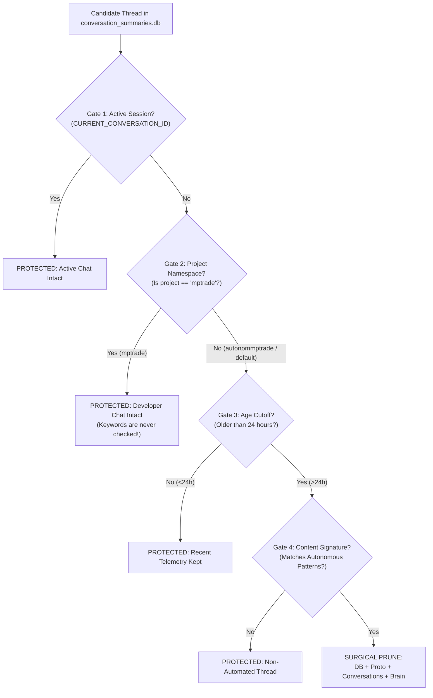

# Antigravity CLI Storage Architecture & Thread Retention Safety Report

## Executive Summary

This report outlines the storage architecture of the **Google Antigravity CLI** (`~/.gemini/antigravity-cli/`), evaluates the risks of manual or bulk file deletion, and details the **Defense-in-Depth** safety mechanisms implemented in [`prune_llm_threads.py`](file:///home/predut/mptrade/orchestratorOS/admin/prune_llm_threads.py).

> [!IMPORTANT]
> **Bulk deletion (`rm -rf`) inside `~/.gemini/antigravity-cli/` is strictly unsafe.**
> The directory hosts critical state including active Google OAuth tokens, IDE settings, binary runtimes, active presence locks, and manual developer conversation history. Pruning must always occur through surgical, multi-gated retention logic.

---

## 1. Directory Anatomy & Risk Analysis

The `~/.gemini/antigravity-cli/` directory is the single source of state for the Antigravity engine and IDE.

| Path | Purpose | Risk if Deleted |
| :--- | :--- | :--- |
| `antigravity-oauth-token` | Google Cloud OAuth authentication token. | **High:** CLI immediately disconnects; autonomous background trading evaluations fail; requires browser re-login. |
| `settings.json` | Global CLI config, model preferences, permissions. | **High:** Settings revert to unconfigured defaults. |
| `bin/`, `builtin/` | Antigravity engine executables, Node runtime, skills. | **Critical:** Antigravity CLI binary stops executing. |
| `presence/*.lock` | Process locks for currently executing agents. | **High:** Agent collisions, corrupted concurrent turns. |
| `conversations/<cid>.db` | SQLite databases storing trajectory steps for each thread. | **High:** Loss of conversation history; corruption of active turns. |
| `brain/<cid>/` | Task logs, artifacts, and persistent transcript files. | **Medium:** Loss of generated artifacts and execution logs. |
| `conversation_summaries.db` | Master index queried by Antigravity IDE sidebar. | **High:** UI errors, blank session history in IDE. |
| `*summaries_proto.pb` | Fast Protobuf caches for sidebar rendering. | **Medium:** Cache desynchronization with database. |

---

## 2. Multi-Layered Protection (Defense-in-Depth)

A key architectural design question is: **What happens if a developer manually uses the same keywords as the bot inside their own manual coding session?**

To ensure absolute safety, [`prune_llm_threads.py`](file:///home/predut/mptrade/orchestratorOS/admin/prune_llm_threads.py) enforces a **5-layer protective filter chain**. Content matching is only reached if all prior isolation gates permit it.



### Gate 1: Active Session Exclusion
* **Mechanism:** Reads `CURRENT_CONVERSATION_ID` from the execution environment.
* **Guarantee:** The active conversation currently interfacing with the user is never touched under any circumstance.

### Gate 2: Workspace / Project Boundary Isolation (Crucial Defense)
* **Mechanism:** Checks `project_id` and project metadata in `~/.gemini/config/projects/`.
* **Guarantee:** The user's primary development workspace (`mptrade`, UUID `3ed4aa5d-0873-407a-a8e9-c21a932a565c`) is in `PROTECTED_PROJECT_NAMES`.
* **User Keyword Safety:** **Even if you write prompts using the exact same phrases** (e.g. *"macroeconomic geopolitical risk assessment"*, *"crypto risk evaluation"*, or *"analiză risc tranzacție"*), **your thread will NEVER be pruned**. Gate 2 aborts evaluation immediately—the content filter in Gate 4 is never even reached for manual workspace threads.

### Gate 3: Temporal Retention Horizon (24h Grace Period)
* **Mechanism:** Evaluates `last_modified_time` against UTC `now() - timedelta(days=1.0)`.
* **Guarantee:** Threads generated today remain accessible in the Antigravity IDE sidebar and log files so you can inspect recent autonomous LLM decisions.

### Gate 4: Content Pattern Verification
* **Mechanism:** Matches titles and prompt previews against `AUTONOMOUS_PROMPT_PATTERNS`.
* **Guarantee:** Within the autonomous namespace (`autonommptrade`), only machine-generated evaluation cycles are targeted.

### Gate 5: Atomic Multi-Store Synchronization
* **Mechanism:** When a thread is pruned, it is atomically purged across:
  1. `conversation_summaries.db` (SQLite master index)
  2. `conversations/<cid>.db` (SQLite trajectory)
  3. `brain/<cid>/` (Artifacts and task logs)
  4. `annotations/<cid>.pbtxt` & `presence/<cid>.lock`
  5. `agyhub_summaries_proto.pb` & `jetbox_summaries_proto.pb` (Protobuf binary index)
* **Guarantee:** Zero orphaned files, zero broken links, and zero crashes in the Antigravity IDE UI.

---

## 3. Storage Audit & Current Health Metrics

An audit conducted on `2026-10-07` confirms that the storage layer is healthy and well-bounded:

| Domain | Item Count | Storage Consumed | Status |
| :--- | :--- | :--- | :--- |
| **User Development (`mptrade`)** | 13 threads | ~165 MB (Conversations) + ~300 MB (Brain) | **Protected:** Contains long-term architectural dialogues, tool execution histories, and test runs. |
| **Autonomous Trader (`autonommptrade`)** | 18 threads | **7.75 MB** | **Active & Managed:** All created within the last 12 hours; oldest will be auto-pruned at the 24h mark. |
| **Orphaned Conversations** | 0 files | 0.00 MB | **Perfect:** 100% synchronization between SQLite index and disk files. |
| **System & Media Caches** | - | 180 MB (`backup_migration_mptrade`), 19 MB (`log/`) | **Stable.** |

---

## 4. Operational Invocations

The pruning process runs unattended through two automated linear choke points:

1. **System Crontab (`manage_logs.sh`)**:
   Runs every 3 hours (`CURRENT_HOUR % 3 == 0`):
   ```bash
   python3 orchestratorOS/admin/prune_llm_threads.py --days 1
   ```
2. **Daemon In-Process Watchdog (`intelligence/daemon.py` & `macro_analyzer.py`)**:
   Runs every 3 hours (`thread_prune_interval_sec = 10800.0`), invoking `prune_old_cli_threads()` directly.
3. **Manual CLI Inspection (Dry-Run)**:
   ```bash
   ./orchestratorOS/run_python.sh orchestratorOS/admin/prune_llm_threads.py --dry-run -v
   ```

---

## Summary Conclusion
The Antigravity CLI storage is fully stabilized. Manual deletion of `~/.gemini/antigravity-cli/` is both unnecessary and dangerous. Dual-layer isolation (Project Boundary + Content Verification) ensures complete separation between user development and automated machine-reasoning threads.
