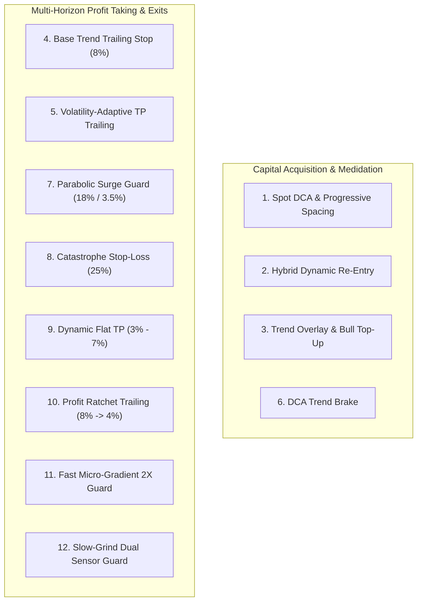

# Fleet Strategy Catalog and Venue Configuration Guide

> **Document Status:** Active Canonical Architecture Guide  
> **Last Updated:** October 2026  
> **Target Subsystems:** `strategies/spot_dca.py`, `strategies/spot_dca_rules.py`, `kraken/config.env`, `hyperliquid/config.env`, `tradeall.py`

---

## 1. Executive Summary & Cross-Venue Scope

The automated trading fleet employs a modular, shared execution engine for spot trading, alongside dedicated venue-specific engines for legacy or specialized markets:

1. **Shared Engine (`strategies/spot_dca.py` + `strategies/spot_dca_rules.py`):**
   - **Kraken (`kraken/kraken_bot.py`):** Live on `HYPEUSD`, `TAOUSD`, `ADAUSD`.
   - **Hyperliquid (`hyperliquid/hl_bot.py`):** Live on `HYPE` spot.
   - **Coverage:** Every single strategy, exit rule, and profit guard implemented in the shared engine is **100% available and compatible with both Kraken and Hyperliquid**.
2. **Independent Engines:**
   - **Binance (`tradeall.py`, `rtrade.py`, `assetguardian.py`):** Uses a distinct pipeline based on multi-timeframe linear regression (`pricewindow.py`), Kalman filter direction gating, and `binance_api/trailing_stop.py`.
   - **Trading212 (`212trading/t212_bot.py`):** Dedicated IPO/equity watcher with laddered exits.

---

## 2. Configuration Scoping: Decoupled by Design

A fundamental architectural question:  
*If a strategy is enabled or disabled in `kraken/config.env`, does it concurrently change on Hyperliquid?*

### **NO. Venue configurations are strictly isolated and decoupled.**

```
                         ┌─────────────────────────────┐
                         │   Shared Execution Engine   │
                         │   (strategies/spot_dca.py)  │
                         └──────────────┬──────────────┘
                                        │
                 ┌──────────────────────┴──────────────────────┐
                 ▼                                             ▼
   ┌───────────────────────────┐                 ┌───────────────────────────┐
   │        Kraken Bots        │                 │      Hyperliquid Bot      │
   │    (kraken_bot.py)        │                 │       (hl_bot.py)         │
   ├───────────────────────────┤                 ├───────────────────────────┤
   │ Config: kraken/config.env │                 │ Config: hyperliquid/      │
   │ State:  kraken/.state_*.  │                 │         config.env        │
   │         json              │                 │ State:  hyperliquid/      │
   │ Pairs:  HYPE, TAO, ADA    │                 │         .state_HYPE.json  │
   └───────────────────────────┘                 └───────────────────────────┘
```

### Why Decoupling is Enforced:
1. **Capital Allocation Differences:** Kraken allocates ~$3,900 USD per pair, whereas Hyperliquid operates with an isolated smaller USDC collateral balance (~$1,050 USDC budget).
2. **Fee Structures:** Kraken spot fees (~0.16% maker / 0.26% taker) differ from Hyperliquid spot fees (~0.04% maker / 0.07% taker).
3. **Risk Containment:** Parameter tuning or testing on one exchange does not unexpectedly alter the risk posture or order generation on another exchange.

### How to Manage Settings:
- **Independent Control (Default):** Modify [`kraken/config.env`](file:///home/predut/mptrade/kraken/config.env) to affect only Kraken pairs, or [`hyperliquid/config.env`](file:///home/predut/mptrade/hyperliquid/config.env) to affect only Hyperliquid.
- **Synchronous Activation:** When you want identical behavior across both venues (e.g. enabling `STRAT_SURGE_GUARD=true`), set the parameter in **both** `kraken/config.env` and `hyperliquid/config.env`.

---

## 3. Full Inventory of the 12 Fleet Strategies & Modules

All 12 mechanisms are native to `strategies/spot_dca.py`:



### Detail of Each Strategy

| # | Strategy / Module | Status Kraken | Status HL | Core Logic & Math |
| :- | :--- | :--- | :--- | :--- |
| **1** | **Progressive Spot DCA** | **ACTIVE** (`avg_tp`) | **ACTIVE** (`avg_tp`) | Buys base amount, then places up to $N$ DCA buys on price drops, progressively widening spacing by `+0.25pp` each tier to reduce drawdown. |
| **2** | **Hybrid Dynamic Re-Entry** | **ACTIVE** (`true`) | **ACTIVE** (`true`) | In bull trend, buys shallow pullbacks ($0.8\% - 3.5\%$). In sideways/bear, waits for a defensive $-2.0\%$ drop before re-entering. |
| **3** | **Trend Overlay & Top-Up** | **ACTIVE** (`true`) | Standby (`false`) | On confirmed bull trend (SMA-30 / regime), tops up with entry size and switches from limit TP to trailing stop. |
| **4** | **Base Trend Trailing Stop** | **ACTIVE** (`8.0%`) | **ACTIVE** (`5.0%`) | Rides the bull market peak; exits when price pulls back by the configured percentage from the highest price seen. |
| **5** | **Volatility-Adaptive Trailing**| **ACTIVE** (`true`) | **ACTIVE** (`true`) | Adapts the trailing distance using rolling 1h/4h volatility: $\text{trail} = \text{clamp}(k \times \sigma, \text{min}, \text{max})$. |
| **6** | **DCA Trend Brake** | **ACTIVE** (`true`) | Standby (`false`) | Detects severe downward velocity ($\le -1.5\%$) and halts further DCA purchases until the free-fall stabilizes. |
| **7** | **Parabolic Surge Guard** | **ACTIVE** (`true`) | **ACTIVE** (`true`) | **Calibrated winner (+26.4% altcoin alpha):** If a coin surges $\ge 18\%$ in 72h or from entry, exits on a $3.5\%$ pullback from peak (dynamic clamp $18\% - 26\%$, vol multiplier $8.0$). |
| **8** | **Catastrophe Stop-Loss** | Standby (`0.0%`) | Standby (`0.0%`) | Optional emergency utility floor: disabled by default in spot DCA to avoid crystallizing pullbacks before recovery. |
| **9** | **Dynamic Flat TP** | **ACTIVE** (`true`) | **ACTIVE** (`true`) | In flat markets, scales take-profit dynamically between 3.0% (choppy noise) and 7.0% (breakout cusp) based on regime strength. |
| **10**| **Profit Ratchet Trailing** | Standby (`false`) | Standby (`false`) | Ratchets the trailing stop tighter (from 8% down to 4%) as unrealized gains expand beyond 8%, locking in accumulated gains. |
| **11**| **Fast Micro-Gradient Guard** | **ACTIVE** (`true`) | **ACTIVE** (`true`) | If profit $\ge 2\times \text{TP}$ (+10%), monitors rolling 5m candles; immediately sells if a 1.0% micro-drop occurs. |
| **12**| **Slow-Grind Dual Sensor** | Standby (`false`) | Standby (`false`) | For positions held $\ge 7\text{d}$ with $\ge 15\%$ gain, exits if a 1.5% flash drop (15m) or 2.5% structural drop occurs. |

---

## 4. Alternative Order Execution Modes in the Engine

Beyond the 12 core algorithmic rules, `strategies/spot_dca.py` supports these operational switches:

1. **Tranche Take-Profit (`STRAT_TP_TRANCHES`):**
   - Syntax: `"3:50,6:50"`
   - Splits exits into partial tranches (e.g. sell 50% at +3% gain, and remaining 50% at +6% gain).
2. **SMA Trend Exit Break (`STRAT_TREND_EXIT_BREAK=true`):**
   - Exits the trend position as soon as the candle close falls below the SMA-30, rather than waiting for a percentage trailing stop.
3. **Classic Fixed Take-Profit (`STRAT_TP_TREND_HOLD=false`):**
   - Disables trailing entirely and places a classic resting limit order at exactly `+STRAT_TAKEPROFIT_PCT%` (e.g. +5.0%).

---

## 5. Live Process Reload Procedures

When any configuration parameter is updated:

1. **Orchestrator Supervision:**  
   Processes are managed by `orchestratorTrade/orchestrator.py` under the systemd unit `python_orchestrator.service`.
2. **Zero-State Loss Guarantee:**  
   All bots persist their live positions, cycles, average buy prices, and open orders in `.state_<PAIR>.json`. Terminating a bot process via `SIGTERM` (`kill -15 <PID>`) triggers a graceful restart by orchestrator within 5 seconds.
3. **Reloading Kraken Only:**
   ```bash
   kill -15 $(pgrep -f "kraken_bot.py")
   ```
4. **Reloading Hyperliquid Only:**
   ```bash
   kill -15 $(pgrep -f "hl_bot.py")
   ```

---

## 6. Harmonization and Orthogonality Invariants

To avoid rule clashing, parameter bloat, and strategy cannibalization, the engine enforces three explicit harmonization invariants:

1. **Harmonization of Conflict #1 (Ratchet Trailing vs Parabolic Surge Guard):**
   - When both `STRAT_TREND_TRAIL_DYNAMIC` and `STRAT_SURGE_GUARD` are active, `dynamic_trend_trail_pct` clamps its minimum trailing stop distance to `max(min_trail_pct, 5.0)`.
   - **Rationale:** Prevents a tight 3.0% ratchet from prematurely stopping out normal volatility (+8% to +20%) before the parabolic surge threshold (+25%) can develop. Once +25% is reached, Surge Guard takes command with its tight 2.5% exhaustion exit.
2. **Harmonization of Conflict #2 (Tranche TP vs Trailing Hold):**
   - When `STRAT_TP_TRANCHES` is populated (e.g. `3:50,6:50`), the engine places staged limit sell orders without being canceled by `tp_trend_hold`. When empty (default), all-or-nothing trailing hold operates.
3. **Harmonization of Conflict #3 (Unified Re-entry vs Obsolete Volatility Scaling):**
   - `STRAT_REENTRY_HYBRID_ENABLED` is the single canonical re-entry policy (shallow pullback in bull trends, defensive drop in bear/chop, with 48h TTL lockout protection). The legacy `STRAT_REENTRY_ADAPTIVE` flag is deprecated and retired.
4. **Retirement and Code Removal of Binary Regime Gate (`STRAT_TP_REGIME_GATE`):**
   - The crude binary true/false gate that blocked take-profit trailing during regime lag has been completely removed from active `config.env` files and excised from the core execution engine. Market regime is now continuously integrated via mathematical indicators (`regime.strength`, `dynamic_flat_tp_pct`).
5. **Spot DCA Stop-Loss Removal from Active Configs:**
   - In pure spot DCA, tight stop-losses (12%-18%) are empirically proven to be the single largest loss driver (crystallizing the dip right before recovery). The dead parameter `STRAT_STOP_LOSS_PCT` has been removed from active production configs, cleanly defaulting to `0.0` (disabled), while retaining optional parameter support as a catastrophic emergency API.

