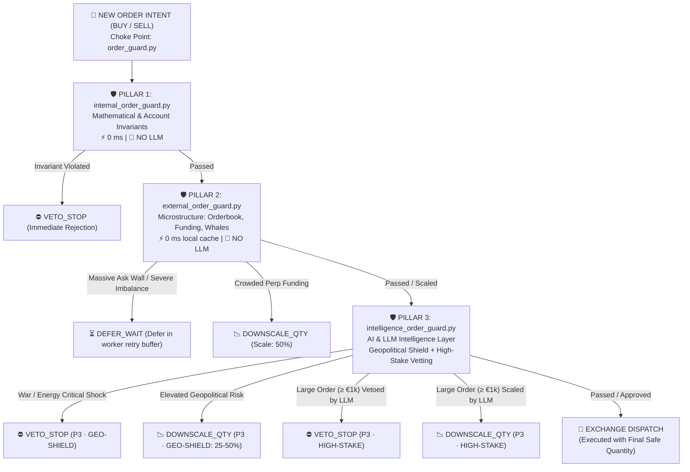

# MPTrade Fortress Architecture: Pillars, Guards, Brakes & Triggers

**Status:** Production Reference  
**Last Updated:** October 2026  
**Audience:** Core Developers, Quant Officers, System Architects  

---

## 1. Top-Level Entry Point & Architectural Choke Point

[`order_guard.py`](file:///home/predut/mptrade/order_guard.py) is the **single top-level root entry point** for all trading engines (`tradeall`, `rtrade`, `monitortrades`, `kraken`, `hyperliquid`). No order can reach an exchange without traversing this choke point.

`order_guard.py` coordinates the **Three-Pillar Fortress** in a strict sequential pipeline, maintaining clean separation of concerns and deterministic fail-closed protection:



---

## 2. LLM Usage Classification Matrix

To ensure absolute transparency between microsecond execution and qualitative reasoning, LLM usage is strictly classified across the three pillars:

| Pillar | Guard Module | LLM Status | Execution Latency | Frequency / Cadence |
| :--- | :--- | :--- | :--- | :--- |
| **Pillar 1** | [`internal_order_guard.py`](file:///home/predut/mptrade/internal_order_guard.py) | 🚫 **NO LLM** (Pure Math) | $0\text{ ms}$ (In-memory) | Every single order intent |
| **Pillar 2** | [`external_order_guard.py`](file:///home/predut/mptrade/external_order_guard.py) | 🚫 **NO LLM** (Pure Microstructure) | $0\text{ ms}$ (Local cache) | Every BUY order intent |
| **Pillar 3** | [`intelligence_order_guard.py`](file:///home/predut/mptrade/intelligence_order_guard.py)<br>↳ [`geopolitical_order_guard.py`](file:///home/predut/mptrade/geopolitical_order_guard.py) | 🤖 **BACKGROUND LLM** | $< 1\text{ ms}$ at pre-trade | Asynchronous cycle: **Every 4.5 hours** |
| **Pillar 3** | [`macro_analyzer.py`](file:///home/predut/mptrade/intelligence/macro_analyzer.py)<br>↳ `sentiment_advisor_eval.json` | 🤖 **BACKGROUND LLM** | $0\text{ ms}$ at pre-trade | Asynchronous cycle: **Every 3.0 hours** |
| **Pillar 3** | [`intelligence_order_guard.py`](file:///home/predut/mptrade/intelligence_order_guard.py)<br>↳ [`high_stake_guard.py`](file:///home/predut/mptrade/intelligence/sentiment/guards/high_stake_guard.py) | 🤖 **ACTIVE LLM** | $\sim 10\text{--}15\text{ s}$ | Event-driven: **Only on BUY $\ge 1,000\text{ EUR}$** |

---

## 3. Pillar-by-Pillar Detailed Architecture

### Pillar 1: Mathematical Invariants & Base Risk (Internal)
* **File:** [`internal_order_guard.py`](file:///home/predut/mptrade/internal_order_guard.py)
* **Role:** Internal mathematical invariants, capital preservation, execution mechanics.
* **LLM:** 🚫 **NO LLM** — Deterministic math, $0\text{ ms}$.
* **Guards & Triggers:**
  1. `daily_limit_guard`: Rolling 24h loss budget (`max_daily_loss_eur`). Blocks trading if account drawdown threshold is breached.
  2. `profit_guard` & `surge_profit_floor_guard`: Reentry profit floor & trailing margin protection. Prevents selling below breakeven basis or dumping into an active parabolic surge.
  3. `inventory_guard`: Position exposure caps per symbol and globally.
  4. `stale_cache_guard` & `spread_and_liquidity_guard`: Rejects orders on stale price ticks ($> 10\text{s}$) or abnormally wide spreads.
  5. `weibull_exhaustion_guard`: Statistical Weibull hazard ratio detecting trend exhaustion. Triggers `DOWNSCALE_QTY` (default: 25% scale via `weibull_exhausted_scale = 0.25`).

---

### Pillar 2: Market Microstructure & Flow (External)
* **File:** [`external_order_guard.py`](file:///home/predut/mptrade/external_order_guard.py) *(mirrors `internal_order_guard.py`)*
* **Role:** Spot orderbook depth, large whale limit walls, perpetual derivatives crowding.
* **LLM:** 🚫 **NO LLM** — Pure quantitative market microstructure, $0\text{ ms}$ local telemetry cache.
* **Guards & Triggers:**
  1. `OrderbookWallGuard` (`[P2 · ORDERBOOK]`):
     - *Telemetry:* `cachedb/orderbook_depth_collect.json`
     - *Trigger 1:* `min_buy_imbalance < 0.25` (less than 25% bids in top 20 book levels).
     - *Trigger 2:* Overhead ask wall exceeding `whale_wall_usd_limit` (default: $\$1,000,000$) within 1–2% of entry price.
     - *Brake:* `DEFER_WAIT` (holds order in worker retry queue until wall softens or pulls) or `VETO_STOP`.
  2. `FundingCrowdingGuard` (`[P2 · FUNDING]`):
     - *Telemetry:* `cachedb/funding_rates_collect.json`
     - *Trigger:* Perpetual funding rate exceeds `funding_max_long_rate = 0.0005` (0.05% per 8h), signaling overcrowded long positioning prone to long squeezes.
     - *Brake:* `DOWNSCALE_QTY` (scales down size by `funding_crowded_scale = 0.50`) or `VETO_STOP`.
  3. `WhaleDivergenceGuard` (`[P2 · WHALE-FLOW]`):
     - *Telemetry:* `cachedb/whale_oi_collect.json`
     - *Trigger:* Open Interest surging alongside aggressive net whale short positioning divergence.
     - *Brake:* `DEFER_WAIT` or `VETO_STOP`.

---

### Pillar 3: AI Intelligence Layer (Geopolitical Shield, Sentiment Advisor & High-Stake LLM)
* **Files:** [`intelligence_order_guard.py`](file:///home/predut/mptrade/intelligence_order_guard.py), [`geopolitical_order_guard.py`](file:///home/predut/mptrade/geopolitical_order_guard.py), [`intelligence/sentiment/guards/high_stake_guard.py`](file:///home/predut/mptrade/intelligence/sentiment/guards/high_stake_guard.py), [`intelligence/macro_analyzer.py`](file:///home/predut/mptrade/intelligence/macro_analyzer.py)
* **Role:** Qualitative AI reasoning, macro shock detection, and real-time high-notional risk vetting.
* **LLM:** 🤖 **ACTIVE & ASYNC LLM** (Google Gemini via isolated `agy` CLI).
* **Guards & Sub-Components:**
  1. `GeopoliticalThreatShield` (`[P3 · GEO-SHIELD]`):
     - *Async Background Cycle:* Evaluated every 4.5 hours (`macro_llm_interval_h = 4.5`) via LLM reasoning on international news feeds (`cachedb/news_feed_collect.json`).
     - *Output File:* `cachedb/geopolitical_threat_eval.json`.
     - *Pre-Trade Check:* $< 1\text{ ms}$ local disk cache read on every BUY order.
     - *Threat Levels:*
       - `NORMAL` ($\text{risk} < 0.35$): `ALLOW`.
       - `ELEVATED` ($0.35 \le \text{risk} < 0.70$): `DOWNSCALE_QTY` (scale to 50%).
       - `HIGH` ($0.70 \le \text{risk} < 0.85$): `DOWNSCALE_QTY` (scale to 25%).
       - `CRITICAL_SHOCK` ($\text{risk} \ge 0.85$, kinetic war escalation, oil embargo, systemic banking freeze): `VETO_STOP` (hard block on all new long entries).
  2. `SentimentAdvisor` (`[P3 · SENTIMENT ADVISOR]`):
     - *Async Trigger:* Periodic background cadence every 3.0 hours (`sentiment_advisor_interval_h = 3.0`).
     - *Telemetry:* `cachedb/fear_greed_collect.json`, 24h market breadth (advancers/decliners), top trader long/short exposure.
     - *Output File:* `cachedb/sentiment_advisor_eval.json`.
     - *Regimes:*
       - **Market Bias:** `BULLISH` | `NEUTRAL` | `CAUTION` | `BEARISH`
       - **Recommended Action:** `ALLOW` | `TRIM_PROFITS` | `DEFENSIVE` | `HALT_NEW_BUYS`
       - **Risk Level:** `LOW` | `MODERATE` | `HIGH` | `EXTREME`
  3. `HighStakeGuard` (`[P3 · HIGH-STAKE]`):
     - *Pre-Trade Trigger:* Fires **only** when computed order notional $\ge$ `llm_min_notional_eur = 1000.0`. Orders below 1,000 EUR pass immediately with $0\text{ ms}$ latency (`ACCEPT`).
     - *Context Ingested:* Real-time synthesis of L2 orderbook imbalance, overhead whale walls, funding rates, whale OI positioning, Fear & Greed index, and current geopolitical threat state.
     - *Decisions:*
       - `APPROVED`: Allows execution (`ALLOW`, 100% scale).
       - `DOWNSCALE`: Reduces size (`DOWNSCALE_QTY`, suggested scale 25%–75%).
       - `REJECTED`: Vetoes order (`VETO_STOP`, 0% scale).
     - *Fallback Policy:* Configurable via `llm_fallback = allow | downscale | veto` on timeout (`llm_timeout_sec = 25.0`).

---

## 4. The Unified Brake System (`BrakeAction`)

Canonical definition in [`intelligence/internal/guards/guard_decision.py`](file:///home/predut/mptrade/intelligence/internal/guards/guard_decision.py):

| Brake Action | Execution Effect | Scale Range | Notification Label |
| :--- | :--- | :--- | :--- |
| **`ALLOW`** | Order proceeds unaltered | `1.0` (100%) | `🧭 ACCEPT` |
| **`DOWNSCALE_QTY`** | Scales down notional / quantity | `0.10` – `0.75` | `🛡 SCALE {pct}%` |
| **`DEFER_WAIT`** | Defers execution in worker retry queue | `0.0` (transient) | `🛡 DEFER` |
| **`VETO_STOP`** | Immediate rejection of order intent | `0.0` (0%) | `🛡 BLOCK` |
| **`HALT_SYSTEM`** | Emergency kill switch (halts all engine activity) | `0.0` | `🛑 EMERGENCY HALT` |

### Guard Operation Modes ([`order_guard.conf`](file:///home/predut/mptrade/order_guard.conf))
* **`off`**: Guard is bypassed completely (zero evaluations).
* **`shadow`**: Guard runs full analytics, logs actions, and dispatches push alerts on phone (`shadow_notify = 1`), but **does not alter or block** real orders.
* **`enforce`**: Guard actively intervenes in live order routing (vetoes, scales, or defers).

### Composition & Priority Rules
1. **Veto Precedence (Fail-Closed):** If any guard (P1, P2, or P3) returns `VETO_STOP`, the order is blocked immediately.
2. **Compound Downscaling:** Multiple downscale recommendations compound conservatively:
   $$\text{Final Scale} = \min(\text{Scale}_{\text{P1}}, \text{Scale}_{\text{P2}}, \text{Scale}_{\text{P3}})$$
3. **Transient Deferral:** `DEFER_WAIT` routes the order into [`order_retry.py`](file:///home/predut/mptrade/order_retry.py), re-checking micro conditions on each cycle rather than discarding intent permanently.

---

## 5. Telemetry & Cache Storage Standard (`cachedb/`)

To decouple heavy network ingestion from microsecond trading loops, cache files follow a strict Single Source of Truth (SSOT) convention:
* **`*_collect.json`**: Raw telemetry collected from external feeds (orderbooks, rates, feeds).
* **`*_eval.json`**: Evaluated analytical synthesis produced by intelligence engines.

```text
cachedb/
├── orderbook_depth_collect.json     # P2: Spot top-20 bids/asks depth & wall detection
├── funding_rates_collect.json       # P2: Binance/Perp funding rate telemetry
├── whale_oi_collect.json            # P2: Open interest & whale net position telemetry
├── fear_greed_collect.json          # P3: Fear & Greed index (0-100)
├── news_feed_collect.json           # P3: Raw multi-source international news headlines
├── sentiment_advisor_eval.json      # P3: Sentiment Advisor evaluation (3.0h LLM cycle)
└── geopolitical_threat_eval.json    # P3: Geopolitical threat assessment (4.5h LLM cycle)
```

---

## 6. Notification & Alerting Engine ([`notify_engine/`](file:///home/predut/mptrade/notify_engine/))

All bot and guard alerts flow through `notify_engine.alertnotifiers.notify` into dedicated ntfy topics with deduplication and email mirroring:

| Category | Source Key | Ntfy Topic | Purpose & Policy |
| :--- | :--- | :--- | :--- |
| **GUARD** | `order_guard` | `ntfy-guard-8a35d7` | P2 (Orderbook, Funding, Whale) and P3 High-Stake alerts. 30m per-symbol cooldown. |
| **MACRO** | `macro_shadow` | `ntfy-macro-8a35d7` | P3 Sentiment Advisor regimes and P3 Geopolitical Threat changes. |
| **TRADES** | `tradeall`, `monitortrades` | `ntfy-trades-b50189` | Live executions, position scaling, take-profit triggers. |
| **PRICE** | `price_notifier` | `ntfy-price-85a945` | Key price threshold breakouts and trend reversals. |
| **ERROR** | `watchdog`, OS scripts | `ntfy-error-941582` | Critical system errors, auto-mirrored to SMTP Email via [`mailer.py`](file:///home/predut/mptrade/notify_engine/mailer.py). |

### Standard Alert Format
* **Title:** Direct and action-oriented: `🛡 [{PILLAR} · {GUARD}] {ACTION} {SIDE} {SYMBOL}`
* **Line 1 (Order Parameters):** `Order: {SIDE} {QTY} {SYMBOL} @ ${PRICE} · €{NOTIONAL} (Scale: {SCALE}%)`
* **Line 2 (Secondary Metrics):** `Imbalance: {BIDS}% bids vs {ASKS}% asks | Overhead Wall: ${WALL} @ ${PRICE}`
* **Line 3 (Concise Rationale):** `Reason: {1-2 sentence clean explanation without redundant prefixes}`

---

## 7. Antigravity OS Integration & Housekeeping

* **Dual Workspace Isolation:**
  - `mptrade` (`3ed4aa5d-...`): Protected interactive user engineering workspace.
  - `autonommptrade` (`f5f9d01f-...`): Sandboxed background bot workspace for automated LLM queries.
* **Protobuf Hub Synchronization:**
  - `ensure_proto_synced` in [`orchestratorOS/admin/prune_llm_threads.py`](file:///home/predut/mptrade/orchestratorOS/admin/prune_llm_threads.py) continuously mirrors entries from headless `jetbox_summaries_proto.pb` into GUI `agyhub_summaries_proto.pb`, ensuring all autonomous guard threads appear instantly in the Antigravity IDE sidebar.
* **Automated Retention Management:**
  - Automated autonomous threads older than 24 hours are pruned daily via cron, while manual engineering discussions in `mptrade` are strictly preserved.
