# Analiza Arhitecturală a Pilonilor de Inteligență și Utilizarea LLM-ului în mptrade

**Data**: 07 Octombrie 2026  
**Status**: Documentație oficială de producție  
**Componente cheie**: `globaltelemetry_collector.py`, `macro_analyzer.py`, `intelligence_order_guard.py`, `order_guard.py`, `intelligence/`

---

## 1. Sinteza Pilonilor de Inteligență

Sistemul `mptrade` utilizează o arhitectură pe **4 Piloni de Inteligență**, decuplată pentru viteză maximă de execuție și protecție multi-strat:

```mermaid
flowchart TD
    subgraph P1["Pilonul 1: Baza Matematică & Statistică Internă (intelligence/internal/)"]
        direction TB
        M1["Filtru Kalman 1D (Trend & Viteză)"]
        M2["Gradient Inflection & Surge"]
        M3["Weibull Survival (Trend Exhaustion P90)"]
        M4["ParabolicSurgeGuard (Anti-FOMO)"]
        M5["NoiseFloorGuard & Regim Volatilitate"]
        note1["100% Matematică locală (0 ms, FĂRĂ LLM)"]
    end

    subgraph P2["Pilonul 2: Microstructură & Flow Extern (intelligence/external/)"]
        direction TB
        OB["L2 Orderbook Depth & Imbalance (15s)"]
        WALL["OrderbookWallGuard (Detectare Ziduri)"]
        WHALE["Whale Positioning & Divergențe (60s)"]
        DERIV["Funding Rates & Open Interest Perps (30s)"]
        note2["Telemetrie baze externe (0 ms execuție, FĂRĂ LLM)"]
    end

    subgraph P3["Pilonul 3: Sentiment & LLM Reasoning (intelligence/sentiment/)"]
        direction TB
        FG["Fear & Greed Collector (API / TTL 1h)"]
        MB["Market Breadth 24h Advance/Decline"]
        HSG["GeminiHighStakeGuard<br/>(Event-driven: BUY >= 1000 EUR)"]
        ADV["GeminiMarketAdvisor<br/>(On-demand / TTL 30m / cachedb)"]
        note3["Google Gemini LLM integrat"]
    end

    subgraph P4["Pilonul 4: Macro Geopolitical Shield (intelligence/macro/)"]
        direction TB
        RSS["Fluxuri RSS Google News (la fiecare 120s)"]
        POOL["Rolling Pool Rulant 4h (deduplicat)"]
        S1["Stage 1: Keyword Frequency Screening"]
        S2["Stage 2: Digest Check (Șoc Macro)"]
        S3["Stage 3: Gemini Flash Reasoning (la 4.5 ore / 16200s)"]
        GEO_GUARD["GeopoliticalShockGuard (Veto / Downscale)"]
        note4["Google Gemini LLM integrat"]
    end

    P1 --> GUARD["order_guard.py (Execuție boti / Latență microsecunde)"]
    P2 --> GUARD
    P3 --> GUARD
    P4 --> GUARD
```



---

## 2. Diferențierea Strictă: Pilonul 1 vs. Pilonul 3

### Pilonul 1 — Baza Matematică Pură (`intelligence/internal/`)
- **Rol**: Protecție anti-FOMO și detecție matematică a extenuării mișcărilor de preț.
- **Tehnologii**:
  - Filtre Kalman de viteză constantă (`KalmanTrendTrigger`).
  - Distribuții empirice Weibull de timp de supraviețuire a trendului (`WeibullExhaustionGuard`).
  - Calcul de deviație parabolică de preț (`ParabolicSurgeGuard`).
  - Estimare de volatilitate și prag de zgomot (`NoiseFloorGuard`).
- **Caracteristică esențială**: **Nu apelează niciodată LLM**. Rulează 100% în memorie locală la fiecare tic de preț cu latență $0\text{ ms}$.

### Pilonul 3 — Sentiment & LLM Reasoning (`intelligence/sentiment/`)
- **Rol**: Integrarea psihologiei de piață și a raționamentului calitativ prin LLM.
- **Tehnologii**:
  - `FearGreedCollector`: Index de frică și lăcomie cu acțiuni contrariene.
  - `MarketBreadthCollector`: Avans/declin pe 24h pe piața Binance.
  - `GeminiHighStakeGuard`: Verificare în timp real a riscului la ordine mari.
  - `GeminiMarketAdvisor`: Consilier macro/sentiment calitativ.

---

## 3. Unde și Cum se Folosește LLM-ul (Google Gemini via `agy CLI`)

LLM-ul (`gemini-3.8-flash-low` prin CLI-ul local `agy`) este invocat în sistem **strict în două locuri**:

### A. Consilierul Periodic de Piață (`GeminiMarketAdvisor`) — Pilonul 3
- **Fișier sursă**: `intelligence/sentiment/sentiment_advisor.py`
- **Output**: `cachedb/gemini_macro_advisor.json`
- **Ce evaluează**:
  - Fear & Greed Index (valoare, etichetă, variație pe 7 zile).
  - 24h Market Breadth (% monede pe plus, schimbare mediană, regim).
  - Telemetria de balene și derivate.
- **Sinteză generată**:
  - `market_bias`: `BULLISH` | `BEARISH` | `NEUTRAL` | `CAUTION`
  - `risk_level`: `LOW` | `MODERATE` | `HIGH` | `EXTREME`
  - `confidence`: $0.0 - 1.0$
  - `summary`: Rezumat executiv în 1-2 fraze
  - `key_risks`: Listă de riscuri structurale
  - `recommended_action`: `ACCUMULATE` | `HOLD` | `TRIM_PROFITS` | `DEFENSIVE`
- **Frecvență și Trigger**:
  - **Cache TTL**: **30 de minute** (`1800.0` secunde). Dacă cache-ul este valid, returnează instant fără apel extern.
  - **Trigger**: **On-demand** (la cerere, de ex. din panoul `intelligence/cli.py`).
  - **Observație de producție**: **Nu rulează automat în bucla din `intelligence_daemon.py`**, evitând consumul redundant de resurse.

### B. Guardul pentru Ordine de Miză Mare (`GeminiHighStakeGuard`) — Pilonul 3
- **Fișier sursă**: `intelligence/sentiment/guards/high_stake_guard.py`
- **Integrare**: Apelat direct în `order_guard.py` (`check_intelligence_guards`).
- **Frecvență și Trigger**:
  - **Fără frecvență de timp (Event-Driven)**: Se declanșează strict în momentul în care un bot de tranzacționare dorește să transmită un ordin.
  - **Condiții de activare**:
    1. Tip ordin: `BUY` (ordinele de SELL sau Stop-Loss sunt scutite).
    2. Valoare noțională: $\ge 1000\text{ EUR}$ (`min_notional_eur = 1000.0`). Ordinele sub 1000 EUR trec instant cu 0 ms latență.
    3. Protecție cache noțional: dacă un context de ordin a fost deja evaluat la un nivel similar de noțional ($\pm 20\%$), decizia este refolosită fără re-interogare LLM.
- **Decizii posibile**: `allow`, `downscale` (ex: 25% sau 50% din cantitate), `hard_veto` (blocare completă).

### C. Scutul Macro Geopolitic (`GeopoliticalThreatAnalyzer`) — Pilonul 4
- **Fișier sursă**: `intelligence/macro/geopolitical_analyzer.py`
- **Output**: `cachedb/geopolitical_threat_state.json`
- **Pipeline pe 3 Etape**:
  1. *Stage 1 (Regex Screening)*: Filtrare locală rapidă pe cuvinte cheie în feed-urile RSS Google News colectate la fiecare **120 secunde** într-un pool rulant de 4 ore (`cachedb/news_feed_history.json`).
  2. *Stage 2 (Digest Check)*: Verificare frecvență și densitate amenințări.
  3. *Stage 3 (LLM Reasoning)*: Invocare Gemini Flash pentru analiza geopolitică detaliată a întregului pool agregat.
- **Frecvență și Trigger**:
  - **Frecvență periodică automată în daemon**: **4.5 ore (16200 secunde)** (`MACRO_LLM_INTERVAL_SEC=16200`).
  - **Trigger de siguranță**: Dacă nu apar șocuri majore în știri, Stage 3 se execută cel mult o dată la 4.5 ore.
- **Impact asupra boților**:
  - `NORMAL`: Fără restricții.
  - `ELEVATED`: Reduce dimensiunea noilor ordine de BUY la 50%.
  - `CRITICAL_SHOCK`: Veto complet pe toate cumpărările noi (vânzările/ieșirile rămân permise).

---

## 4. Configurare Proiect CLI & Housekeeping Autonom

- **Proiect dedicat Antigravity**:
  - În `~/.gemini/config/projects/default-cli-project.json` și `autonommptrade.json`, numele proiectului a fost redenumit în **`autonommptrade`**.
  - Toate interogările autonome din `gemini_client.py` folosesc `--project autonommptrade`, separând istoricul automat de sesiunile manuale.
- **Curățare automată (Pruning)**:
  - Scriptul `orchestratorOS/admin/prune_llm_threads.py` rulează automat prin cron (la fiecare 3h) și din daemon.
  - **Retenție configurată**: **1 zi** (`CLI_THREAD_RETENTION_DAYS=1.0`).
  - Thread-urile automate mai vechi de 24h sunt șterse automat din SQLite și din sistemul de fișiere, prevenind acumularea fișierelor și consumul de memorie.

---

## 5. Matricea Parametrilor de Configurare (`config.env`)

```ini
# Pilonul 4: Evaluare Geopolitică & LLM
MACRO_LLM_INTERVAL_SEC=16200          # Interval minim Stage 3 Gemini (16200s = 4.5 ore)
MACRO_NEWS_INTERVAL_SEC=120           # Frecvență colectare RSS și agregare rulantă (120s = 2 min)

# Housekeeping & CLI
CLI_THREAD_RETENTION_DAYS=1.0         # Ștergere automată a thread-urilor CLI > 1 zi
AGY_PROJECT=autonommptrade            # Spațiu de lucru dedicat apelurilor autonome

# Pilonul 3: Guard Noțional Mare (order_guard.conf)
gemini_guard_mode=shadow              # Mod rulare: off | shadow | enforce
gemini_min_notional_eur=1000.0        # Prag noțional minim pentru activare LLM
gemini_timeout_sec=12.0               # Timeout maxim pentru răspunsul LLM
gemini_fallback=allow                 # Acțiune de siguranță în caz de timeout LLM
```
