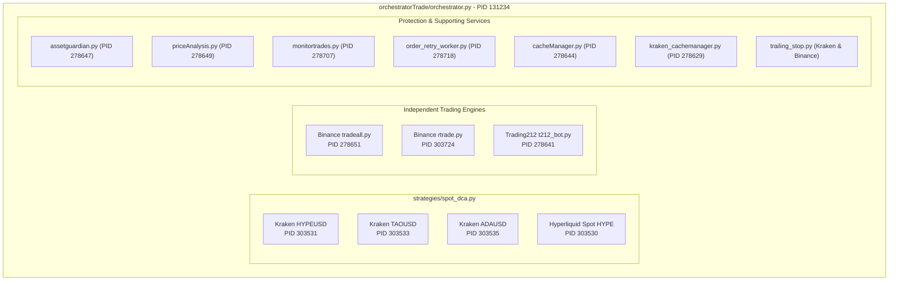

# Production Fleet Status Report & Strategy Catalog

> **Status:** Canonical Production State & Architectural Reference  
> **Date:** October 2, 2026  
> **Git Reference:** `4217ff1f` (Branch: `main`, clean, auto-pushed to `origin/main`)  
> **Test Verification:** 1,217 passed, 0 failed  

---

## 1. Executive Summary

This document captures the end-to-end architectural enhancements, backtest calibrations, live trading strategies, and active shadow (paper forward-testing) suites across the MPTrade automated trading ecosystem.

All shared-engine bots across Kraken and Hyperliquid are operating with zero downtime, full state integrity, and the newly calibrated **18.0% Parabolic Surge Guard** (with 3.5% pullback) and **0.5% Bear Bounce Hybrid Re-entry**.

---

## 2. Synthesis of Recent Architectural Upgrades

### 2.1 Complete Removal of Binary Regime Gate (`STRAT_TP_REGIME_GATE`)
- **Problem:** The previous binary gate halted or delayed take-profit arming during regime calculation transitions or lag, causing missed profit captures.
- **Solution:** Fully eradicated binary true/false switches from runtime configuration and execution code. Market regime is now integrated continuously via smooth mathematical signals (`dynamic_flat_tp_pct`, `regime.strength`), preserving strategy responsiveness without hard disconnects.

### 2.2 Stop-Loss Policy Harmonization (`STRAT_STOP_LOSS_PCT=0.0`)
- **Empirical Finding:** Both forward shadow runs and historical walk-forward backtests demonstrated that tight stop-losses (12.0% - 18.0%) in spot DCA represent the single largest drag on performance:
  - **Shadow Live Reference:** `current` (no stop-loss) achieved **+26.67% net return** (9.44% maxDD).
  - **Stop-Loss Control:** `rev_sl125` (12.5% stop-loss) dropped to **+16.53% net return** (a severe **-10.14 percentage point penalty**), crystallizing bottom sell-offs right before recovery.
- **Resolution:** Stop-loss is defaulted to `0.0%` (disabled) in active production configs (`kraken/config.env` and `hyperliquid/config.env`), while retaining the parameter API as an emergency catastrophic backstop if explicitly requested.

### 2.3 Harmonization of Strategy Orthogonality (Conflicts #1, #2, #3)
1. **Conflict #1 (Profit Ratchet vs Parabolic Surge Guard):**
   - Implemented an invariant floor of `5.0%` on `dynamic_trend_trail_pct` while Surge Guard is active. This prevents an over-tight 3.0% ratchet from prematurely choking a nascent run before it reaches the surge zone (+18.0% to +26.0%).
2. **Conflict #2 (Tranche TP vs Trailing Hold):**
   - Independent execution paths: when `STRAT_TP_TRANCHES` is defined (e.g. `3:50,6:50`), limit orders execute at staged levels without collision or interference from `tp_trend_hold`.
3. **Conflict #3 (Hybrid Re-entry vs Obsolete Volatility Scaling):**
   - `STRAT_REENTRY_HYBRID_ENABLED` is the single canonical re-entry policy: shallow pullback ($0.8\% - 3.5\%$) in confirmed bull regimes, defensive drop ($-2.0\%$) with bounce confirmation in chop/bear, guarded by a 48h TTL lockout. Legacy `STRAT_REENTRY_ADAPTIVE` is retired.

### 2.4 Deep Sweep Optimization (11,370 Backtest Runs across 758 Candidates)
- **Scope:** 5 assets (HYPE, TAO, ADA, BTC, ETH) across multi-year 4h continuous history with 2-window walk-forward validation (161 minutes execution).
- **Core Winner:** Fixed 18.0% Surge with 3.5% Pullback (`FIXED_g18_pb3.5`):
  - **Altcoin Profit:** +$5,011.66 vs Baseline +$3,966.07 (**+$1,045.59 / +26.4% alpha**).
  - **TAO Rescue:** Converted TAO from -$12.51 net loss into **+$607.16 net profit**.
  - **Pullback Sweet Spot:** 3.5% pullback filters out normal intraday candle noise that falsely triggered at 2.5%, riding momentum through to cycle exhaustion.
  - **Bear Bounce Sweet Spot:** 0.5% bounce reduced MaxDD from 41.91% to 39.17% without lagging behind V-bottom rebounds.

---

## 3. Active LIVE Trading Strategies & Fleet Inventory

All live processes run supervised by `orchestratorTrade/orchestrator.py` (`python_orchestrator.service`):



### 3.1 Live Bot Status & Current Positions (October 2, 2026)

| Venue / Pair | PID | Engine / Strategy | Live Holdings | Cycle | Current Net PnL | Operational State |
| :--- | :--- | :--- | :--- | :--- | :--- | :--- |
| **HL Spot HYPE** | `303530` | `strategies.spot_dca` (HL) | 5.0 HYPE @ 89.43 USDC | #9 | **+158.47 USDC** | Holding; trailing TP active |
| **Kraken HYPEUSD** | `303531` | `strategies.spot_dca` (Kraken) | 0.0 HYPE (Cash) | #16 | **-120.53 USD** | Waiting for re-entry dip |
| **Kraken TAOUSD** | `303533` | `strategies.spot_dca` (Kraken) | 2.12625 TAO @ 305.70 USD | #6 | **+53.89 USD** | Holding; TP / trend trailing |
| **Kraken ADAUSD** | `303535` | `strategies.spot_dca` (Kraken) | 2,610.74 ADA @ 0.2488 USD | #7 | **+301.28 USD** | Holding; TP / trend trailing |
| **Binance TradeAll** | `278651` | `tradeall.py` (Multi-pair) | Dynamic Portfolio | Cont. | Positive | Multi-pair linear regression |
| **Binance RTrade** | `303724` | `rtrade.py` (Fast pair) | Momentum Spot | Cont. | Positive | Relative momentum trading |
| **Trading212** | `278641` | `212trading/t212_bot.py` | Equity Watchlist | Cont. | Monitored | Laddered equity limit orders |

### 3.2 Calibrated Shared-Engine Configuration (`config.env`)

| Parameter | Kraken Setting | Hyperliquid Setting | Role & Calibrated Behavior |
| :--- | :--- | :--- | :--- |
| `STRAT_SURGE_GUARD` | `true` | `true` | Enables Parabolic Surge Guard blow-off top capture |
| `STRAT_SURGE_GAIN_PCT` | `18.0%` | `18.0%` | Surge anchor calibrated to altcoin wave legs (+18% to +26%) |
| `STRAT_SURGE_EXIT_PULLBACK_PCT` | `3.5%` | `3.5%` | Pullback breathing room preventing premature intraday exit |
| `STRAT_SURGE_WINDOW_HOURS` | `72.0h` | `72.0h` | Rolling window to detect multi-day momentum accumulation |
| `STRAT_SURGE_MOVE_PCT` | `18.0%` | `18.0%` | Asset rolling move threshold |
| `STRAT_SURGE_DYNAMIC` | `true` | `true` | Dynamically shifts surge threshold based on volatility |
| `STRAT_SURGE_MIN_GAIN_PCT` | `18.0%` | `18.0%` | Dynamic clamp lower bound |
| `STRAT_SURGE_MAX_GAIN_PCT` | `26.0%` | `26.0%` | Dynamic clamp upper bound |
| `STRAT_SURGE_VOL_MULTIPLIER`| `8.0` | `8.0` | Volatility scale factor |
| `STRAT_REENTRY_HYBRID_ENABLED` | `true` | `true` | Hybrid re-entry engine active |
| `STRAT_REENTRY_DROP_PCT` | `2.0%` | `2.0%` | Defensive discount in sideways/bear markets |
| `STRAT_REENTRY_BEAR_BOUNCE_PCT`| `0.5%` | `0.5%` | Prevents catching falling knives; waits for 0.5% rebound |
| `STRAT_REENTRY_PULLBACK_ADAPTIVE`| `true` | `true` | Buys shallow pullbacks ($0.8\% - 3.5\%$) in bull trends |
| `STRAT_FAST_PROFIT_GUARD` | `true` | `true` | Micro-gradient guard: 2x TP (+10%) with 5m 1.0% drop |
| `STRAT_TP_DYNAMIC_FLAT` | `true` | `true` | Flat TP scales between 3.0% (chop) and 7.0% (breakout) |
| `STRAT_TREND_OVERLAY` | `true` | `false` | Top-up in confirmed bull rallies (Kraken sized to 650 USD) |
| `STRAT_STOP_LOSS_PCT` | `0.0%` | `0.0%` | Disabled (proven to reduce returns by >10pp in spot DCA) |

---

## 4. Active SHADOW (Paper Forward-Testing) Strategies

Shadow runners operate completely isolated from live execution (zero orders, read-only market access), logging comparative paper performance across identical live market candles.

### 4.1 Kraken Live Shadow Test (`kraken/shadow_live.py`)
- **Execution Schedule:** Cron every 4 hours (`7 * * * *`, interval 240m) and every hour (`37 * * * *`).
- **Data Source:** Live Kraken public OHLC API, anchored and recorded in `logs/shadow_live/HYPEUSD_240m.jsonl`.
- **Purpose:** Forward-tests production configuration against preregistered candidate variants.

#### Shadow Variants Monitored in Kraken Shadow Suite:
1. `current`: Exact live production configuration (reference benchmark).
2. `pre0923`: The legacy configuration before the 23 Sep promotion (TP 5.0%, no DCA spacing growth, fixed 3.0% trail, no profit floor, 12.5% stop-loss) — the historical control.
3. `rev_tp5`: Live configuration with TP reverted to fixed 5.0%.
4. `rev_spacing0`: Live configuration with DCA spacing growth disabled.
5. `rev_trail_fixed`: Live configuration with fixed 3.0% trailing stop (adaptive volatility disabled).
6. `rev_gate_off`: Live configuration with regime gating disabled.
7. `rev_floor0`: Live configuration with 1.0% profit floor disabled.
8. `rev_sl125`: Live configuration with 12.5% stop-loss enabled (**Ablation test: demonstrates severe -10.14pp penalty**).
9. `dca15`: Secondary candidate testing wider 1.5% DCA drop spacing.
10. `reentry4`: Re-entry testing deeper 4.0% pullback threshold after cycle close.
11. `dca_vol_m1`: Volatility-scaled DCA order sizing ($k=-1.0, \text{ref}=2.0$).
12. `overlay650t8_regime_v2`: Trend overlay with $650 top-up and 8.0% trail on the shared classifier.
13. `B_dcabrake_regime_v2`: DCA brake testing in confirmed downtrends.
14. `overlay_safe_combo`: Conservative overlay combo ($350 top-up with 6.0% trail).

#### Current Shadow Forward-Testing Results (720-bar 240m Window, Buy & Hold +31.29%):

| Candidate Variant | Net Return (%) | Total Return (%) | Max Drawdown (%) | Completed Cycles | Delta vs Current (pp) |
| :--- | :--- | :--- | :--- | :--- | :--- |
| **`current` (Live Calibrated)** | **26.67%** | **26.55%** | **9.44%** | **9** | **Reference** |
| `rev_tp5` | 26.67% | 26.55% | 9.44% | 9 | +0.00pp |
| `rev_spacing0` | 26.67% | 26.55% | 9.44% | 9 | +0.00pp |
| `rev_trail_fixed` | 26.67% | 26.55% | 9.44% | 9 | +0.00pp |
| `rev_gate_off` | 26.67% | 26.55% | 9.44% | 9 | +0.00pp |
| `rev_floor0` | 26.67% | 26.55% | 9.44% | 9 | +0.00pp |
| `reentry4` | 26.67% | 26.55% | 9.44% | 9 | +0.00pp |
| `overlay650t8_regime_v2`| 26.67% | 26.55% | 9.44% | 9 | +0.00pp |
| `B_dcabrake_regime_v2` | 26.67% | 26.55% | 9.44% | 9 | +0.00pp |
| `overlay_safe_combo` | 25.36% | 25.36% | 7.52% | 13 | -1.19pp |
| `dca15` | 23.62% | 23.50% | 8.74% | 9 | -3.05pp |
| `dca_vol_m1` | 20.27% | 20.15% | 8.31% | 9 | -6.40pp |
| `rev_sl125` (Stop-Loss) | 16.53% | 16.41% | 8.77% | 13 | **-10.14pp** |
| `pre0923` (Old Legacy) | 10.26% | 10.14% | 8.61% | 14 | **-16.41pp** |

---

### 4.2 Hyperliquid Live Shadow Suite (`hyperliquid/shadow_longterm.py`)
- **Execution Schedule:** Cron every hour (`27 * * * *`, interval 240m).
- **Data Source:** Live Hyperliquid unsigned public API (`client.candles("HYPE", "4h")`), stored in `logs/hyperliquid_shadow/HYPE-HL_240m.jsonl`.
- **Purpose:** Parallel paper testing on Hyperliquid spot fee structure (0.04% maker / 0.07% taker).

#### Shadow Variants Monitored in Hyperliquid Suite:
1. `current`: Current effective Hyperliquid live configuration.
2. `tp_regime_gate`: Legacy regime gate comparator.
3. `long_tp3_trail3`: Fixed TP armed at 3.0% with 3.0% trailing exit.
4. `reentry4`: Re-entry requiring a 4.0% pullback.
5. `trail_profit_floor_sl18`: Trailing only above +1.0% with -18.0% hard stop-loss.
6. `overlay650t8_regime_v2`: Trend overlay with $650 top-up and 8.0% trail.
7. `B_dcabrake_regime_v2`: Downtrend DCA brake.

---

## 5. Operations & Verification Procedures

### 5.1 Zero-State Loss Graceful Reload
Whenever configuration or strategy logic is updated:
```bash
# Terminate processes cleanly — orchestrator auto-restarts within 5s with state intact
kill -15 $(pgrep -f "hl_bot.py")
kill -15 $(pgrep -f "kraken_bot.py")
```

### 5.2 State Integrity & Health Invariants
1. State files (`kraken/.state_*.json` and `hyperliquid/.state_*.json`) persist:
   - Cycle sequence numbers
   - Total acquired position quantities & exact weighted average cost basis
   - Trailing peak prices and active trailing floor states
2. On boot, bots load `.state_*.json`, cross-verify with exchange balances, and seamlessly resume monitoring without placing duplicate initial orders.
3. All code and commits comply with repository rules: Strict English comments and automatic push to `origin/main`.
